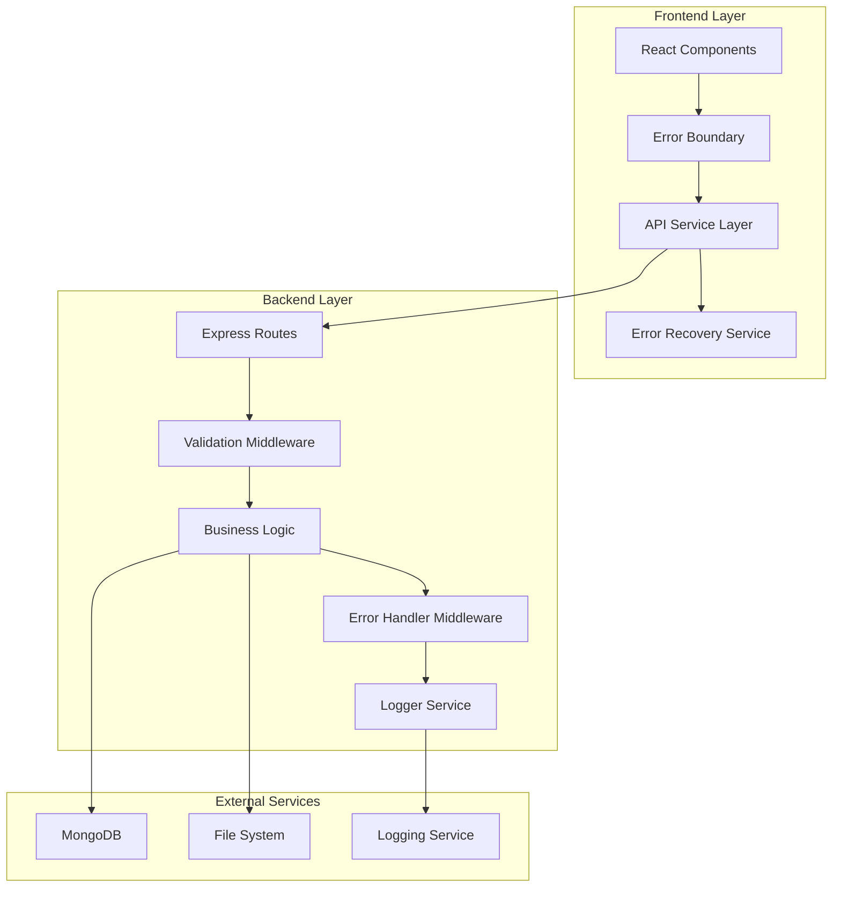
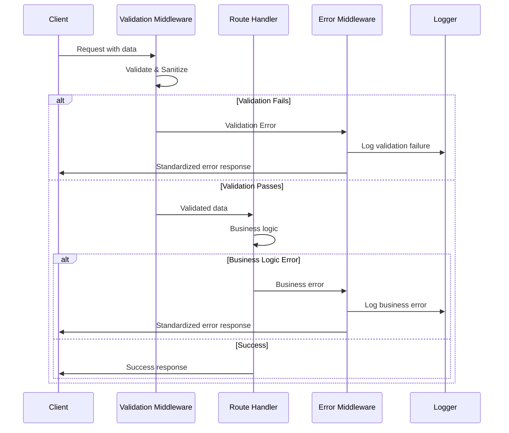

# Design Document: Error Handling and Input Validation System

## Overview

This design addresses the critical error handling and input validation deficiencies in the job portal MERN stack application. The current system lacks comprehensive input validation, consistent error responses, proper error logging, and user-friendly error feedback mechanisms. 

The solution implements a layered approach with centralized error handling middleware, comprehensive input validation, structured logging, and enhanced frontend error recovery mechanisms. This will improve both developer experience through better debugging capabilities and user experience through clear, actionable error messages.

## Architecture

### System Architecture



### Error Flow Architecture



## Components and Interfaces

### Backend Components

#### 1. Validation Middleware System

**Purpose**: Centralized input validation and sanitization for all API endpoints.

**Key Components**:
- `ValidationMiddleware`: Core validation orchestrator
- `SchemaValidator`: Joi-based schema validation
- `Sanitizer`: Input cleaning and security validation
- `FileValidator`: Specialized file upload validation

**Interface**:
```javascript
// Validation middleware factory
const validateRequest = (schema, options = {}) => {
  return async (req, res, next) => {
    // Validation logic
  };
};

// Usage in routes
router.post('/jobs', 
  validateRequest(jobCreationSchema), 
  jwtAuth, 
  createJob
);
```

#### 2. Centralized Error Handler

**Purpose**: Standardized error processing and response formatting.

**Key Components**:
- `ErrorHandler`: Main error processing middleware
- `ErrorFormatter`: Converts errors to standard format
- `ErrorClassifier`: Categorizes errors by type and severity

**Interface**:
```javascript
// Standard error response format
{
  "success": false,
  "error": {
    "code": "VALIDATION_ERROR",
    "message": "User-friendly error message",
    "details": [
      {
        "field": "email",
        "message": "Email is required",
        "code": "REQUIRED_FIELD"
      }
    ],
    "correlationId": "uuid-v4-string",
    "timestamp": "2024-01-15T10:30:00Z"
  }
}
```

#### 3. Logging System

**Purpose**: Comprehensive error and application logging with structured data.

**Key Components**:
- `Logger`: Main logging interface
- `LogFormatter`: Structures log entries
- `LogTransport`: Handles log output (console, file, external service)

**Interface**:
```javascript
// Logger usage
logger.error('Database connection failed', {
  correlationId: req.correlationId,
  userId: req.user?.id,
  operation: 'user.create',
  error: error.message,
  stack: error.stack
});
```

#### 4. Database Error Handler

**Purpose**: Specialized handling of MongoDB errors with proper translation.

**Key Components**:
- `MongoErrorHandler`: Translates MongoDB errors
- `ValidationErrorMapper`: Maps Mongoose validation errors
- `ConnectionManager`: Handles connection issues with retry logic

### Frontend Components

#### 1. API Service Layer

**Purpose**: Centralized API communication with built-in error handling.

**Key Components**:
- `ApiClient`: Main HTTP client with interceptors
- `ErrorInterceptor`: Processes API errors
- `RetryManager`: Handles automatic retries

**Interface**:
```javascript
// API client with error handling
const apiClient = {
  async post(url, data, options = {}) {
    // Built-in error handling and retry logic
  }
};
```

#### 2. Error Recovery Service

**Purpose**: Frontend error recovery and user feedback management.

**Key Components**:
- `ErrorBoundary`: React error boundary for component errors
- `NotificationService`: User-friendly error messages
- `RetryService`: Automatic and manual retry mechanisms
- `FormErrorHandler`: Form-specific error handling

#### 3. Loading and State Management

**Purpose**: Manages loading states and error recovery UI.

**Key Components**:
- `LoadingProvider`: Global loading state management
- `ErrorProvider`: Global error state management
- `RetryProvider`: Retry state and logic management

## Data Models

### Error Response Schema

```javascript
const ErrorResponseSchema = {
  success: Boolean,
  error: {
    code: String,           // Machine-readable error code
    message: String,        // User-friendly message
    details: [{             // Field-specific errors
      field: String,
      message: String,
      code: String
    }],
    correlationId: String,  // For tracking across services
    timestamp: Date,
    retryable: Boolean      // Whether client should retry
  }
};
```

### Validation Schema Examples

```javascript
// Job creation validation schema
const jobCreationSchema = Joi.object({
  title: Joi.string().min(3).max(100).required(),
  maxApplicants: Joi.number().integer().min(1).max(1000).required(),
  maxPositions: Joi.number().integer().min(1).max(100).required(),
  deadline: Joi.date().greater('now').required(),
  skillsets: Joi.array().items(Joi.string().min(1).max(50)).max(20),
  jobType: Joi.string().valid('full-time', 'part-time', 'contract').required(),
  duration: Joi.number().integer().min(0).max(60),
  salary: Joi.number().integer().min(0).max(10000000).required()
});

// User registration validation schema
const userRegistrationSchema = Joi.object({
  email: Joi.string().email().required(),
  password: Joi.string().min(8).pattern(/^(?=.*[a-z])(?=.*[A-Z])(?=.*\d)/).required(),
  type: Joi.string().valid('recruiter', 'applicant').required(),
  name: Joi.string().min(2).max(100).required(),
  contactNumber: Joi.string().pattern(/^\+?[\d\s-()]+$/).when('type', {
    is: 'recruiter',
    then: Joi.required()
  })
});
```

### Log Entry Schema

```javascript
const LogEntrySchema = {
  timestamp: Date,
  level: String,          // 'error', 'warn', 'info', 'debug'
  message: String,
  correlationId: String,
  userId: String,
  operation: String,      // 'user.create', 'job.apply', etc.
  metadata: Object,       // Additional context
  error: {
    message: String,
    stack: String,
    code: String
  }
};
```

## Correctness Properties

*A property is a characteristic or behavior that should hold true across all valid executions of a system-essentially, a formal statement about what the system should do. Properties serve as the bridge between human-readable specifications and machine-verifiable correctness guarantees.*

### Property 1: Comprehensive Input Validation
*For any* API endpoint and any request data, the validation system should validate the request against predefined schemas, return 400 status with field-level errors for invalid data, and verify file uploads for type, size, and content
**Validates: Requirements 1.1, 1.2, 1.4**

### Property 2: Input Sanitization Security
*For any* user input containing potentially malicious content, the sanitizer should clean the input before validation and prevent security vulnerabilities
**Validates: Requirements 1.3**

### Property 3: Validation Error Logging
*For any* validation failure, the error handler should log the failure with complete request details and correlation ID
**Validates: Requirements 1.5**

### Property 4: Standardized Error Response Format
*For any* error condition, the error handler should return a consistent JSON format with error code, user-friendly message, field details, correlation ID, and timestamp
**Validates: Requirements 2.1, 2.2, 2.5**

### Property 5: Database Error Translation
*For any* database error, the error handler should translate technical MongoDB errors into user-friendly messages with appropriate HTTP status codes
**Validates: Requirements 2.3, 5.2, 5.3**

### Property 6: Authentication Error Categorization
*For any* authentication or authorization failure, the error handler should return specific error codes that distinguish between different failure types while maintaining security
**Validates: Requirements 2.4, 6.1, 6.2, 6.3**

### Property 7: Comprehensive Error Logging
*For any* error occurrence, the logger should record structured entries with timestamp, user context, request details, severity categorization, and exclude sensitive information
**Validates: Requirements 3.1, 3.3, 3.4, 3.5**

### Property 8: Critical Error Alerting
*For any* critical error or error rate threshold breach, the logger should trigger immediate alerts to administrators and escalate repeated critical errors
**Validates: Requirements 3.2, 9.2, 9.4**

### Property 9: Frontend Error Recovery
*For any* API or network error, the recovery mechanism should display user-friendly messages, provide appropriate retry options, and preserve user context during recovery
**Validates: Requirements 4.1, 4.2, 4.5, 8.1, 8.2, 8.5**

### Property 10: Form and File Error Handling
*For any* form validation or file upload error, the recovery mechanism should highlight specific fields, provide clear guidance on requirements, and show individual status for multiple operations
**Validates: Requirements 4.3, 4.4, 7.1, 7.2, 7.3, 7.4, 7.5**

### Property 11: Database Connection Resilience
*For any* database connection failure or timeout, the error handler should implement retry logic with exponential backoff, ensure data integrity, and provide appropriate error responses
**Validates: Requirements 5.1, 5.4, 5.5**

### Property 12: Session and Authentication Recovery
*For any* session expiry or password reset request, the recovery mechanism should handle secure redirects with context preservation and secure responses for both valid and invalid scenarios
**Validates: Requirements 6.4, 6.5**

### Property 13: Advanced Recovery Mechanisms
*For any* interrupted file upload or rate limit exceeded scenario, the recovery mechanism should support resumable operations and intelligent request queuing
**Validates: Requirements 8.3, 8.4**

### Property 14: Error Analytics and Monitoring
*For any* system operation, the logger should aggregate error statistics, track patterns by user role and endpoint, and provide real-time dashboard metrics for system health monitoring
**Validates: Requirements 9.1, 9.3, 9.5**

## Error Handling

### Error Categories and Handling Strategy

#### 1. Validation Errors (400 Bad Request)
- **Input validation failures**: Field-level validation errors with specific messages
- **File upload errors**: Size, type, and content validation failures
- **Business rule violations**: Application-specific constraint violations

**Handling Strategy**:
- Return detailed field-level error information
- Preserve user input where safe
- Provide clear guidance on how to fix issues
- Log validation patterns for system improvement

#### 2. Authentication/Authorization Errors (401/403)
- **Invalid credentials**: Login failures, expired tokens
- **Insufficient permissions**: Role-based access violations
- **Session management**: Expired sessions, invalid tokens

**Handling Strategy**:
- Provide specific but secure error messages
- Guide users to appropriate recovery actions
- Implement automatic token refresh where possible
- Log security events for monitoring

#### 3. Resource Errors (404/409)
- **Not found**: Missing resources, invalid IDs
- **Conflicts**: Duplicate entries, concurrent modifications
- **State violations**: Invalid state transitions

**Handling Strategy**:
- Provide context about what was not found
- Suggest alternative actions
- Handle race conditions gracefully
- Implement optimistic locking where needed

#### 4. Server Errors (500+)
- **Database errors**: Connection failures, query timeouts
- **External service failures**: Third-party API issues
- **System errors**: Memory issues, file system problems

**Handling Strategy**:
- Hide technical details from users
- Implement retry logic with backoff
- Provide fallback mechanisms
- Alert administrators immediately

### Error Recovery Patterns

#### 1. Automatic Recovery
- **Network retries**: Exponential backoff for temporary failures
- **Token refresh**: Automatic JWT token renewal
- **Connection pooling**: Database connection management
- **Circuit breakers**: Prevent cascade failures

#### 2. User-Guided Recovery
- **Form preservation**: Maintain user input during errors
- **Step-by-step guidance**: Clear instructions for error resolution
- **Alternative paths**: Suggest different approaches when possible
- **Progress indication**: Show recovery progress to users

#### 3. Graceful Degradation
- **Feature fallbacks**: Disable non-essential features during issues
- **Cached responses**: Serve stale data when fresh data unavailable
- **Offline capabilities**: Allow limited functionality without connectivity
- **Progressive enhancement**: Core functionality always available

## Testing Strategy

### Dual Testing Approach

The error handling system requires both unit testing and property-based testing to ensure comprehensive coverage:

**Unit Tests**: Focus on specific error scenarios, edge cases, and integration points
- Specific error message formatting
- Individual middleware behavior
- Database error translation accuracy
- File upload validation edge cases
- Authentication flow error handling

**Property-Based Tests**: Verify universal properties across all inputs and error conditions
- Error format consistency across all error types
- Validation behavior with random invalid inputs
- Logging completeness for all error scenarios
- Recovery mechanism reliability with various failure patterns
- Security properties with malicious input generation

### Property-Based Testing Configuration

**Testing Framework**: Use `fast-check` for JavaScript property-based testing
- **Minimum iterations**: 100 per property test
- **Error injection**: Systematic fault injection for resilience testing
- **Input generation**: Comprehensive invalid input generation
- **State verification**: Verify system state consistency after errors

**Test Tagging Format**:
```javascript
// Feature: error-handling-validation, Property 1: Comprehensive Input Validation
test('validates all API endpoints consistently', () => {
  fc.assert(fc.property(
    fc.record({
      endpoint: fc.constantFrom('/api/jobs', '/api/applications', '/auth/login'),
      data: fc.anything()
    }),
    ({ endpoint, data }) => {
      // Property test implementation
    }
  ), { numRuns: 100 });
});
```

### Testing Categories

#### 1. Validation Testing
- **Schema compliance**: All endpoints validate against defined schemas
- **Sanitization effectiveness**: Malicious input properly cleaned
- **Error message accuracy**: Field-level errors correctly identified
- **File validation**: Size, type, and content validation working

#### 2. Error Response Testing
- **Format consistency**: All errors follow standard format
- **Status code accuracy**: Appropriate HTTP status codes returned
- **Correlation tracking**: All errors include correlation IDs
- **Security compliance**: No sensitive data in error responses

#### 3. Logging Testing
- **Completeness**: All required information logged
- **Structure consistency**: Logs follow defined schema
- **Security compliance**: Sensitive data excluded from logs
- **Performance impact**: Logging doesn't significantly impact performance

#### 4. Recovery Testing
- **Retry logic**: Exponential backoff working correctly
- **State preservation**: User data maintained during errors
- **UI feedback**: Appropriate loading states and error messages
- **Automatic recovery**: System recovers from transient failures

#### 5. Integration Testing
- **End-to-end flows**: Complete error scenarios from frontend to backend
- **Database integration**: MongoDB error handling working correctly
- **File upload flows**: Complete file validation and error handling
- **Authentication flows**: Complete auth error handling and recovery

### Performance Testing

#### Error Handling Performance
- **Validation overhead**: Measure impact of validation middleware
- **Logging performance**: Ensure logging doesn't block request processing
- **Error processing speed**: Fast error response times
- **Memory usage**: Error handling doesn't cause memory leaks

#### Load Testing with Errors
- **Error rate handling**: System stability under high error rates
- **Resource cleanup**: Proper cleanup after error conditions
- **Concurrent error handling**: Thread safety of error processing
- **Recovery performance**: Speed of automatic recovery mechanisms